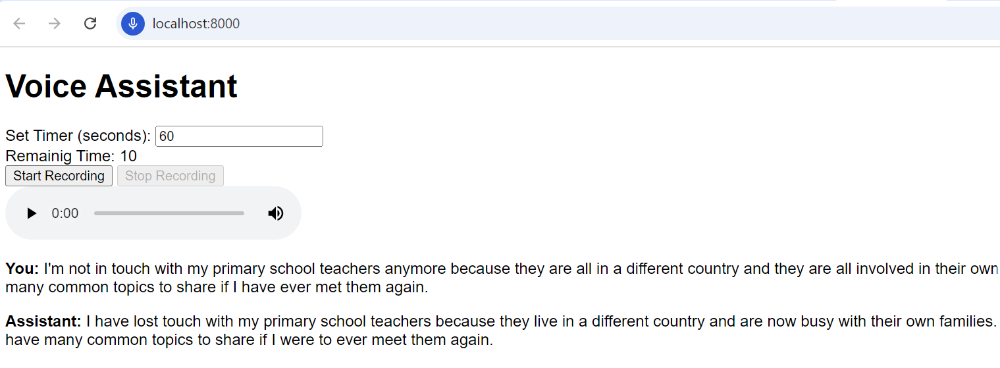

# Language Tutor

A virtua language tutor that helps you to work for English C1 level (coherence, cohesion, vocabulary/grammar, and pronounciation)!

## What can it do?

- [x] Replay your voice recordings
- [x] Display refined versions from LLM 
- [x] Timer to limit answer length 
- [ ] Shadow reading
- [ ] Pronounciation assessement


**Demo**




## How does it work? 

### Frontend

 - [x] HTML/JS
 - [ ] React 
 - [ ] Better storage and speed

### Backend
 - [x] Flask
 - [ ] Java + Sprintbot
 - [ ] API design
 - [ ] Latency and scalability

### Model Endpoints
 - [x] OpenAI 
 - [ ] Deepgram for streaming 
 - [ ] self-hosted Models

### Infrastructure
 - [x] Docker 
 - [ ] Cloud deployment 

## How to use it?


1. Config `API_KEY` after `cp .env.example .env` and adding OpenAI API key.

2. Deploy in the root directory of this project. 

```
$ docker compose up -d --build
[+] Building 1.4s (17/17) FINISHED
 => [web internal] load build definition from Dockerfile                                     

[+] Running 2/2
 ⠿ Network language-tutor_default  Created                                                                                       
 ⠿ Container language-tutor-web-1  Started
```

2. Open http://localhost:8000/ 
