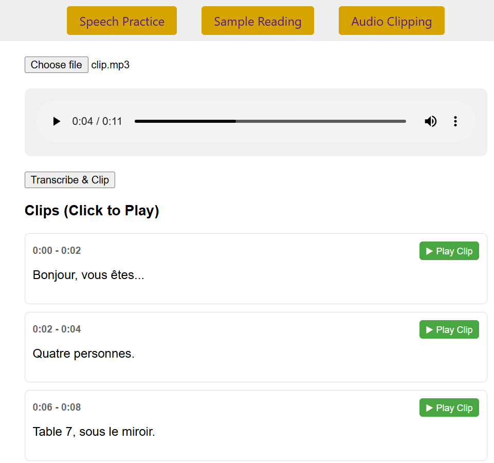

# Speech Coach

While preparing for English and French speaking tests, I noticed that most existing AI-powered tools were too recreational, distracting, and overpriced. So, I decided to create a simple and practical alternative for people who want to improve their speech skills. 

Right now, this app allows you to transcribe your voice recordings, polish transcriptions with OpenAI's models, evaluate the acoustic quality, and learn from real/synthetic audios. These features are super handy for any language learning and any other speech scenarios, like job interviews, since good fluency and clear content are usually all you need to shine while you talk! 🌟🗣️📚  

## Features

- [x] Replay your voice recordings 🔁
- [x] Display refined versions from LLM ✨
- [x] Timer to limit speech length ⏲️
- [x] Shadow reading 📖 of Any Audio, Any Text you like!
- [x] Acoustic assessment 💯 based on a sample audio. 
- [x] Multilingual 🌍 for English, French and more to come. 

## Demo

1. Record yourself and have the recording transcribed. You can also evaluate the acoustics quality of your recordings by comparing it to a synthetic audio generated from the same transcription. 
<!--  -->


2. Shadow reading of any audio you chose or a syntectic one generated from any text content you like!
<!--  -->


## How It Works

### Frontend

- [x] HTML/JS 🌐
- [x] React ⚛️

### Backend

- [x] Flask 🐍
- [x] API design 📡
- [ ] Database 🗄️
- [ ] Message Queue and Redis for scalability 📬

### Model Endpoints

- [x] OpenAI 🤖
- [ ] Self-hosted models 🏠

### Infrastructure

- [x] Docker 🐳
- [x] Cloud deployment ☁️ Free AWS hosting services is expired. A more sustainable cloud deployment is on the way!

## Usage

1. Configure `API_KEY` after copying the example environment file in the `backend` folder:
    ```sh
    cd backend
    cp .env.example .env
    ```
    Add your OpenAI API key to the `.env` file.

2. Deploy the application from the root directory of this project:
    ```sh
    docker compose up -d --build
    ```

3. Open [http://localhost:3000](http://localhost:3000) in your browser. 🌐
